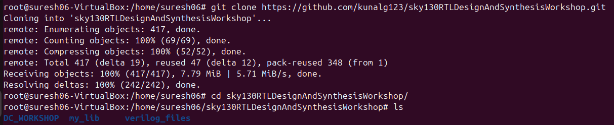
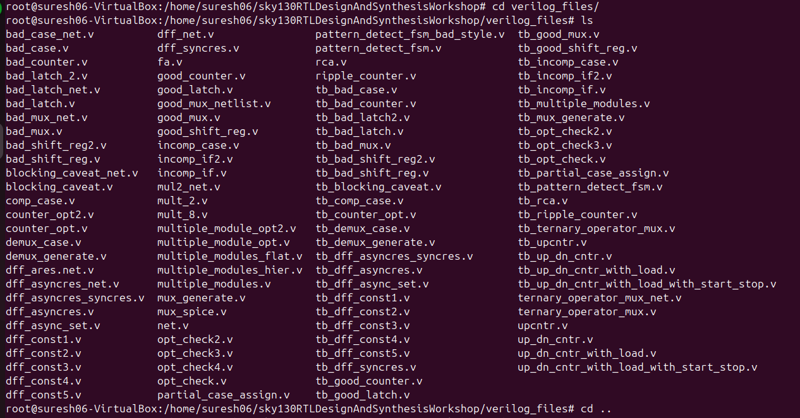
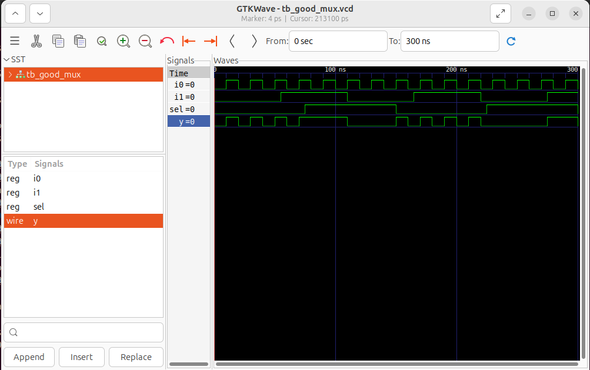
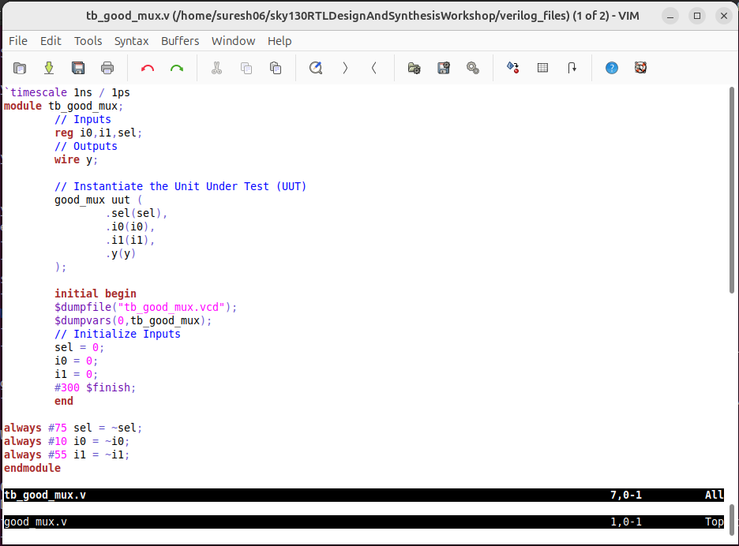
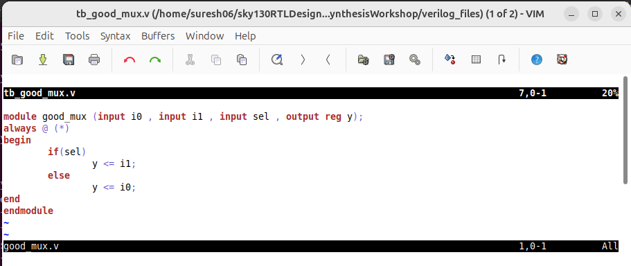
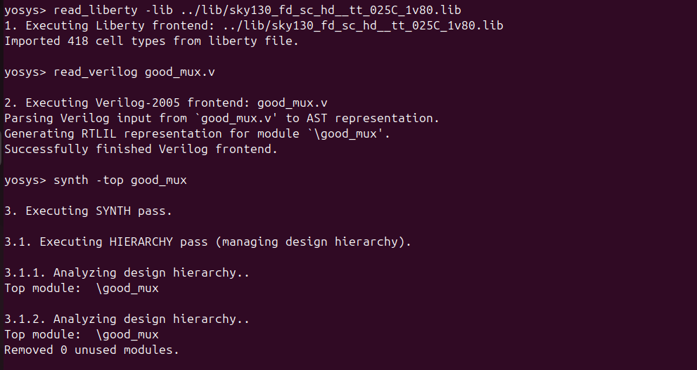
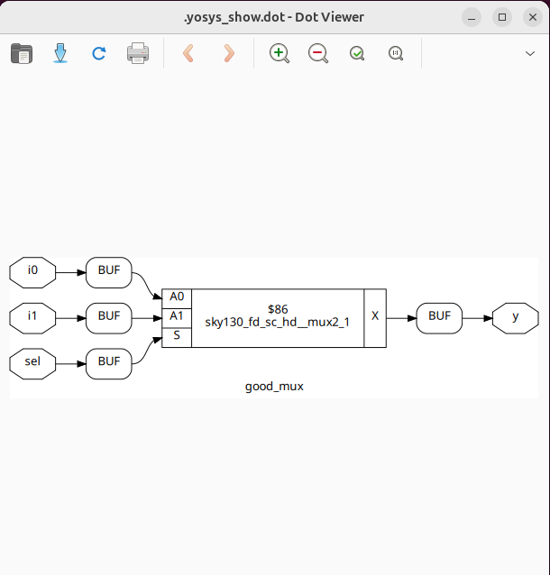
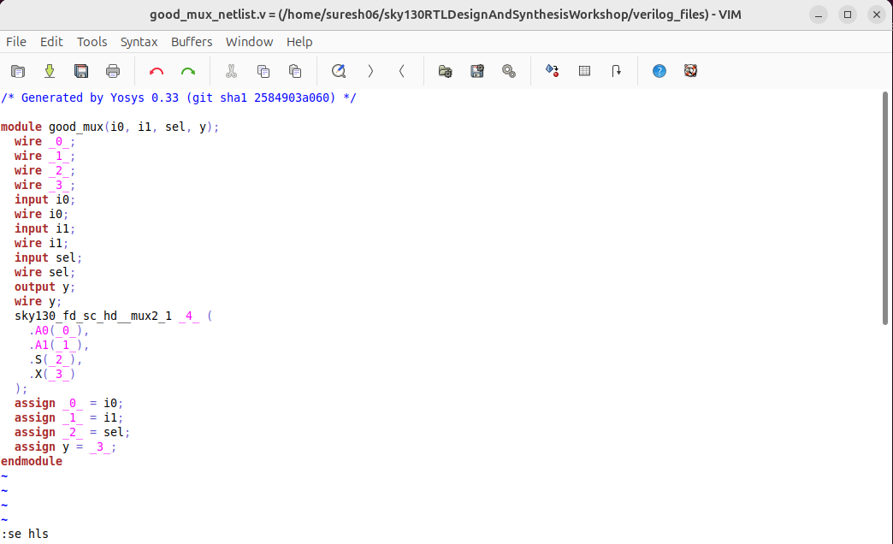

# Day 1 – Introduction to Verilog RTL Design & Synthesis  

Welcome to **Day 1 of the Digital VLSI SoC RTL Design Workshop**.  
In this session, we focus on writing Verilog code, simulating with **Icarus Verilog**, analyzing results with **GTKWave**, and synthesizing RTL designs using **Yosys** and the **Sky130 PDK**.  
This README provides both **conceptual insights** and **hands-on lab instructions** with step-by-step commands.  

---

## 📑 Table of Contents
- Verilog & Testbench Basics  
- Lab Work with Icarus Verilog & GTKWave  
- Introduction to Yosys (Logic Synthesizer)  
- Understanding .lib Files  
- Lab Work with Yosys  
- Outcome  

---

## Verilog & Testbench Basics  

Verilog is a Hardware Description Language (HDL) used to model digital circuits.  
A **design** represents the actual circuit logic, while a **testbench** is written to verify and validate that the design behaves as expected.  
Simulators like **Icarus Verilog** mimic how the hardware would behave before fabrication, saving time and cost.  

---

## Lab Work with Icarus Verilog & GTKWave  

Clone the Workshop Repository  
```bash
$ git clone https://github.com/kunalg123/sky130RTLDesignAndSynthesisWorkshop.git  
$ cd sky130RTLDesignAndSynthesisWorkshop/verilog_files  
```


This repository contains sample Verilog files, testbenches, and standard libraries that will be used throughout the workshop.  

 Explore Files & Check the following folders: lib, my_lib, verilog_files.
  
  
This ensures you know where libraries, RTL files, and testbenches are located.  

Simulate the Design 
```bash
$ iverilog good_mux.v tb_good_mux.v  
$ ./a.out  
$ gtkwave tb_good_mux.vcd
```

Here, the design file and testbench are compiled, executed, and visualized using GTKWave.  
GTKWave allows you to inspect the waveforms and confirm the logic behavior cycle by cycle.  



Open Files in Editor  
``` 
$ gvim tb_good_mux.v -o good_mux.v
```


Opening both design and testbench together allows side-by-side debugging and easier correlation of inputs and outputs.  

---

## Introduction to Yosys (Logic Synthesizer)  

Yosys is an open-source logic synthesis tool that converts RTL Verilog into a **gate-level netlist**.  
It ensures that the Verilog code is implementable in real hardware by mapping it to a set of standard cells from the process technology library.  
This step bridges the gap between abstract RTL and physical chip implementation.  

---

## Understanding .lib Files  

A `.lib` file describes the timing, power, and functional characteristics of standard cells used in a process technology (e.g., Sky130).  
Different cells (slow, fast, low-power) allow designers to balance **speed, area, and power consumption**.  
During synthesis, Yosys consults these libraries to choose the most suitable gates for the given design constraints.  

---

## Lab Work with Yosys  

Start Yosys 
``` bash
$ yosys
``` 
This command launches the Yosys interactive shell where synthesis steps are executed.  

Read the Liberty Library
```bash
$ read_liberty -lib ../lib/sky130_fd_sc_hd__tt_025C_1v80.lib  
$ The library provides the characteristics of gates used during synthesis.  
```
Read the Verilog Design 
```bash
$ read_verilog verilog_files/good_mux.v
```
This loads the design file into Yosys for processing.  

Synthesize the Top Module 
```
$ synth -top good_mux
```

Here Yosys synthesizes the specified top module and prepares it for technology mapping.  


Map RTL to Standard Cells  
```
$ abc -liberty ../lib/sky130_fd_sc_hd__tt_025C_1v80.lib
``` 
This step maps abstract RTL logic into real standard cells defined in the `.lib` file.  

Visualize the Logic  
```
$ show
```
Generates a schematic of the synthesized design, showing how logic gates are interconnected.  



Write the Netlist  
```
$ write_verilog good_mux_netlist.v
```
Saves the synthesized gate-level representation of the design in Verilog format.  

Open the Netlist  
```
$ !gvim good_mux_netlist.v
```
Review the generated netlist to understand how your design has been transformed into gates.  
Generate Simplified Netlist  
```
$ write_verilog -noattr good_mux_netlist.v  
$ !gvim good_mux_netlist.v
```

Creates a cleaner netlist without unnecessary attributes for easier readability.  


---

## Outcome  

By the end of **Day 1**, I successfully:  
- Learned the fundamentals of **Verilog RTL design** and the role of **testbenches** in simulation.  
- Simulated Verilog code using **Icarus Verilog** and verified outputs with **GTKWave waveforms**.  
- Performed **logic synthesis** using **Yosys** and mapped designs to the **Sky130 PDK standard cells**.  
- Understood the role of **.lib files** and how synthesis tools optimize for performance and power.  

This completed the **end-to-end RTL Design Flow**:  
**Verilog Design → Testbench → Simulation → Synthesis → Gate-Level Netlist**  

---

