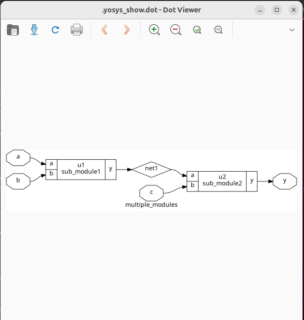
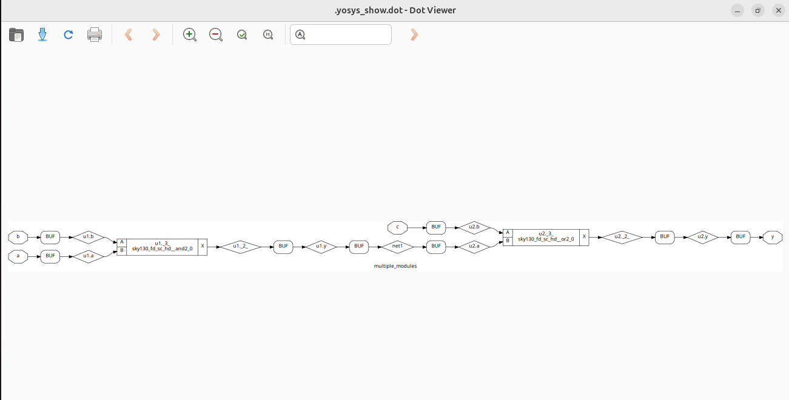
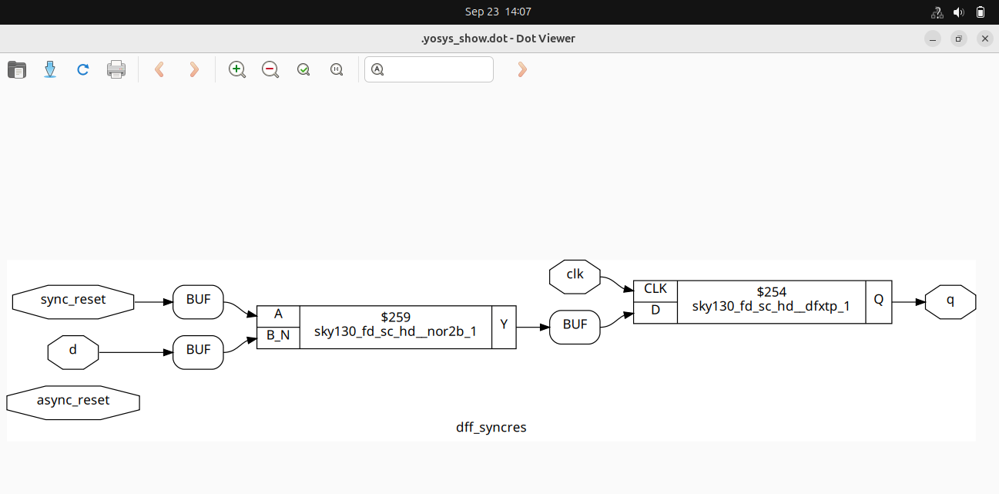
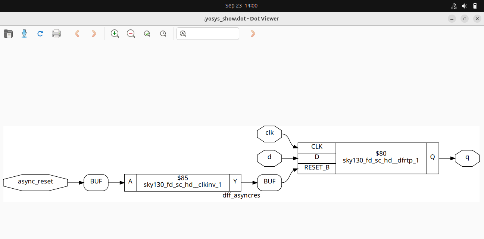
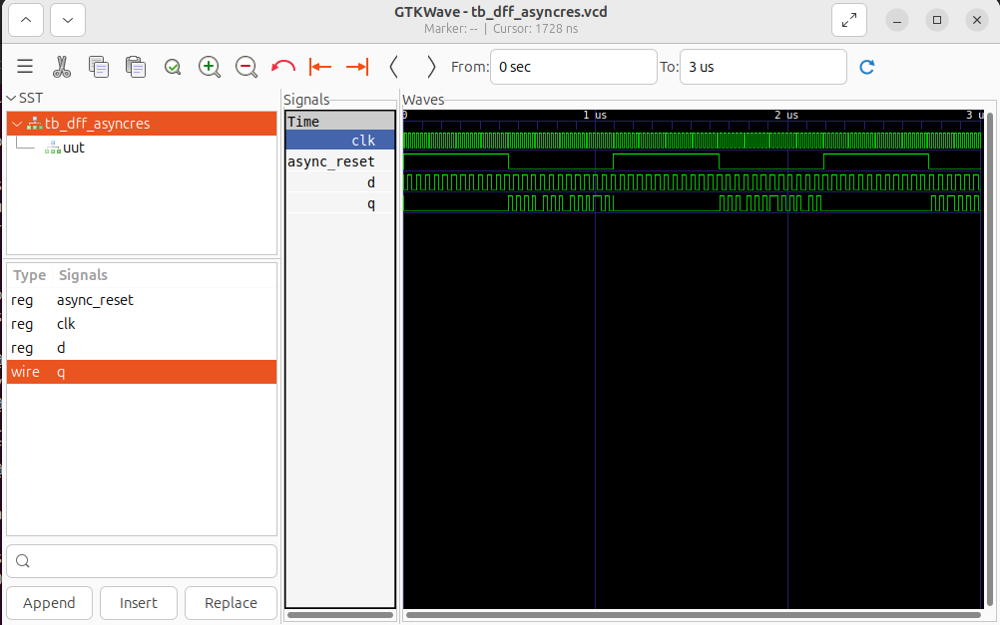
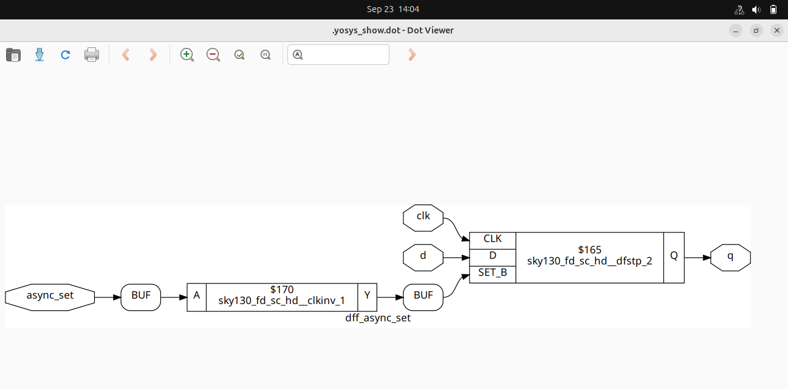
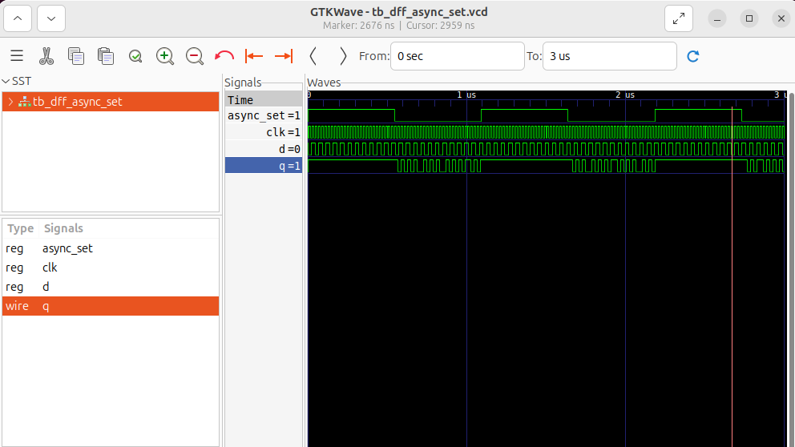
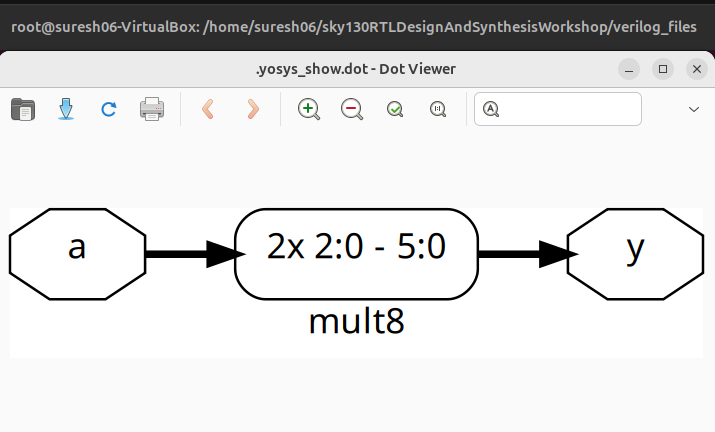
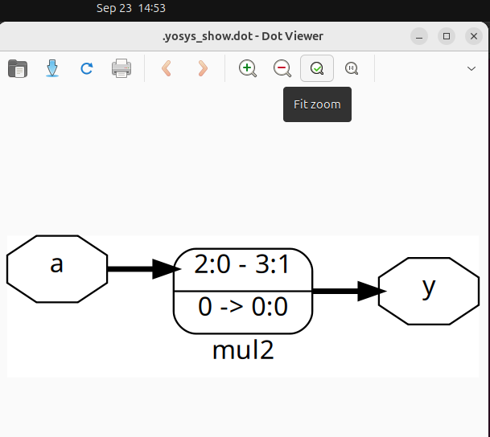

# Day 2 – Timing Libraries, Hierarchical vs Flat Synthesis and Efficient Flop Coding Styles  

This session focuses on **standard cells, .lib files, timing concepts and synthesis flow in Yosys** using the **Sky130 PDK**. The goal is to understand how RTL maps to standard cells and how different coding styles impact synthesis.  

---

## Table of Contents  
- Standard Cells Overview  
- Timing Libraries (.lib)  
- Hierarchical vs Flat Synthesis  
- Flip-Flop Coding Styles  
- Outcome  

---

## Standard Cells Overview  

Standard cells are the **fundamental building blocks** in ASIC design.  
These are pre-characterized logic gates and sequential elements provided in the **Sky130 PDK**.  

Each cell comes with:  
- Functionality (logical operation)  
- Area (how much silicon it occupies)  
- Delay (timing information for different paths)  
- Power consumption (dynamic & leakage power)  

They are like **Lego blocks** for chip design — once RTL is written, the synthesis tool replaces high-level RTL with the appropriate combination of these cells. This ensures portability across technologies while preserving functionality.  

---

## Timing Libraries (.lib)  

A `.lib` file is the **timing library** used by synthesis and STA tools. It describes:  
- **Timing arcs** → input-to-output delays for every cell  
- **Setup and hold times** for sequential elements  
- **Power consumption** across different conditions  
- **Area information** for cost trade-offs  

Libraries are provided for different **PVT corners**:  
- **TT (Typical-Typical)** → normal operation, room temperature, nominal voltage  
- **SS (Slow-Slow)** → slow devices, high delay, worst-case timing  
- **FF (Fast-Fast)** → fast devices, short delay, best-case timing  

Without `.lib`, synthesis cannot map RTL to real silicon because it would not know how fast or how power-hungry a gate is. These libraries are the **bridge between design and physical reality**.  

---

## Hierarchical vs Flat Synthesis  

### Hierarchical Synthesis  
- Each submodule is synthesized independently.  
- Useful for **modularity, reusability and faster debugging**.  
- Netlist preserves the hierarchy.  

``` bash
$ yosys
$ read_liberty -lib ../lib/sky130_fd_sc_hd__tt_025C_1v80.lib
$ read_verilog multiple_modules.v
$ synth -top multiple_modules
$ abc -liberty ../lib/sky130_fd_sc_hd__tt_025C_1v80.lib
$ write_verilog multiple_modules_hier.v
$ show
````



### **Why Submodule Synthesis?**
Breaking a big design into submodules allows teams to work in parallel, reduces compile times, and makes verification easier. In large SoCs, each IP block is synthesized and validated separately before integration. This also allows better **ECO (Engineering Change Order) fixes** without rerunning the whole design.

---

### Flat Synthesis

* Collapses all modules into a **single-level netlist**.
* Provides **better optimization** across module boundaries.
* Harder to debug and less modular.

```bash
$ yosys
$ read_liberty -lib ../lib/sky130_fd_sc_hd__tt_025C_1v80.lib
$ read_verilog multiple_modules.v
$ synth -top multiple_modules
$ abc -liberty ../lib/sky130_fd_sc_hd__tt_025C_1v80.lib
$ flatten
$ show
```



Flat synthesis is **preferred for final tapeout flows**, as it allows the tool to apply global optimizations on timing and area. The trade-off is readability — debugging a flat netlist can be very challenging.

---

## Flip-Flop Coding Styles

Different **reset/set implementations** in RTL directly influence the synthesized cell choice. Choosing the wrong style may lead to unnecessary complexity, area, or timing issues.

### Synchronous Reset

Reset is applied only on the **active clock edge**.

```verilog
always @(posedge clk) begin
  if (reset)
    q <= 0;
  else
    q <= d;
end
```

```bash
$ iverilog dff_syncres.v tb_dff_syncres.v
$ ./a.out
$ gtkwave tb_dff_syncres.vcd
```
Synchronous resets are **cleaner for timing** since everything is aligned with the clock. They are often used in ASIC flows because they avoid introducing asynchronous paths in STA.

---

### Asynchronous Reset

Reset is applied **immediately**, independent of clock.

```verilog
always @(posedge clk or posedge reset) begin
  if (reset)
    q <= 0;
  else
    q <= d;
end
```

```bash
$ iverilog dff_asyncres.v tb_dff_asyncres.v
$ ./a.out
$ gtkwave tb_dff_asyncres.vcd
```



Asynchronous resets are **very common in FPGAs** because they guarantee immediate initialization after power-up. But in ASIC design, care must be taken to properly synchronize reset release to avoid metastability.

---

### Asynchronous Set

Output is set **immediately** when set signal is high.

```verilog
always @(posedge clk or posedge set) begin
  if (set)
    q <= 1;
  else
    q <= d;
end
```


```bash
$ iverilog dff_async_set.v tb_dff_async_set.v -o async_set.out
$ ./async_set.out
$ gtkwave tb_dff_async_set.vcd
```



This style is less common in real designs, but is useful in **control circuits** where a register must be forced to `1` quickly (e.g., interrupt flags). In synthesis, the tool infers dedicated set-reset flip-flops.

### **Why Flops are Introduced in Combinational Circuits?**
Flops are added between combinational stages to **break long logic paths** and to **avoid glitches caused by signal races**. They ensure data is only captured at clock edges, improving timing closure and making circuits more reliable. This technique is also called **pipelining**.

---

## Small Optimization Insight – Multiplication by Constants

Multiplication by powers of two or small constants can be optimized into **shift-and-add operations** by synthesis tools.

* `y = x * 2;` → optimized to a **left shift** (`y = x << 1;`)
* `y = x * 9;` → optimized to `(x << 3) + x `
<div align="center">



<br>



</div>


This reduces area since shift-add logic uses fewer gates compared to a full multiplier. Such optimizations are **automatically handled by Yosys and other compilers**, but writing RTL with shifts instead of multipliers can sometimes give cleaner synthesis results.

---

## Outcome

By the end of **Day 2**, we have:

* Understood **standard cells** as the Lego blocks of digital design.
* Learned how `.lib` files define **timing, area, power, and constraints**.
* Compared **hierarchical and flat synthesis flows**, with trade-offs in optimization vs modularity.
* Simulated and synthesized **different flip-flop coding styles**, seeing how RTL directly affects gate-level mapping.
* Gained insights into **submodule synthesis**, **glitch avoidance using flops**, and **multiplier optimizations**.

**Final Flow Recap:**
**RTL → .lib → Yosys → Netlist → GTKWave Simulation**

---


