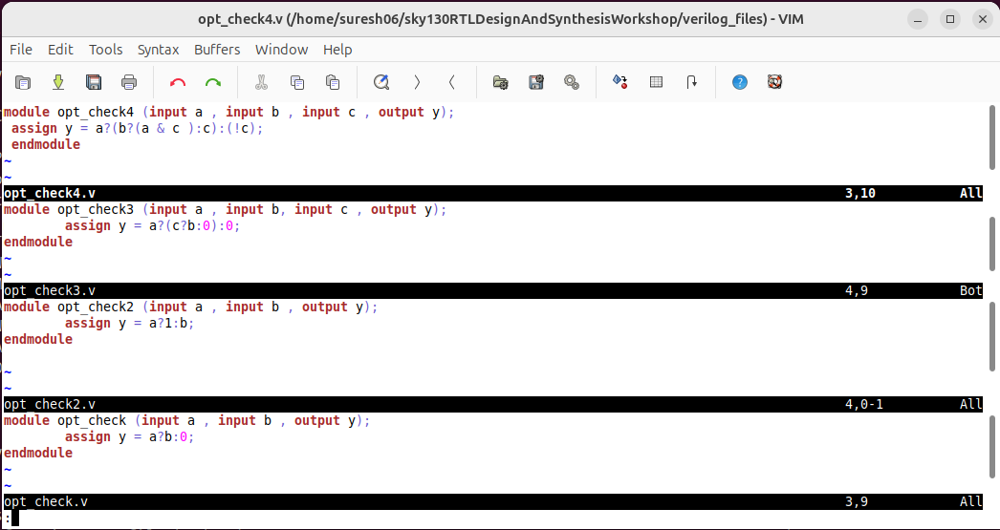
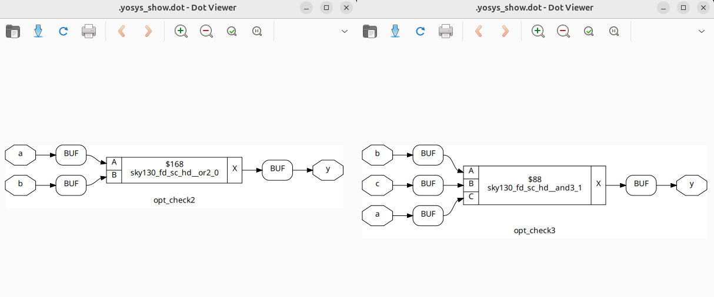
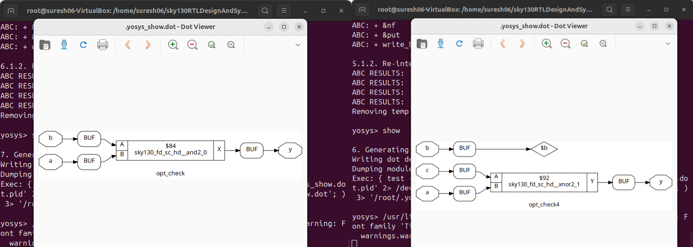
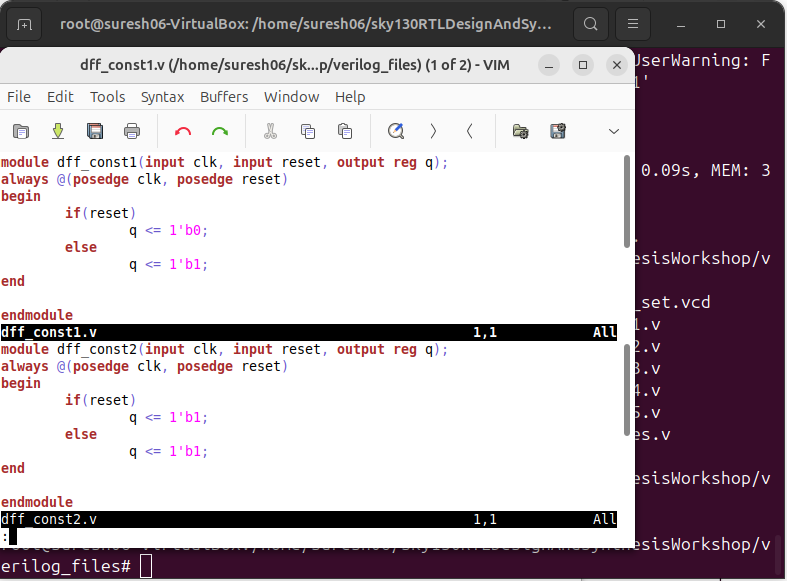
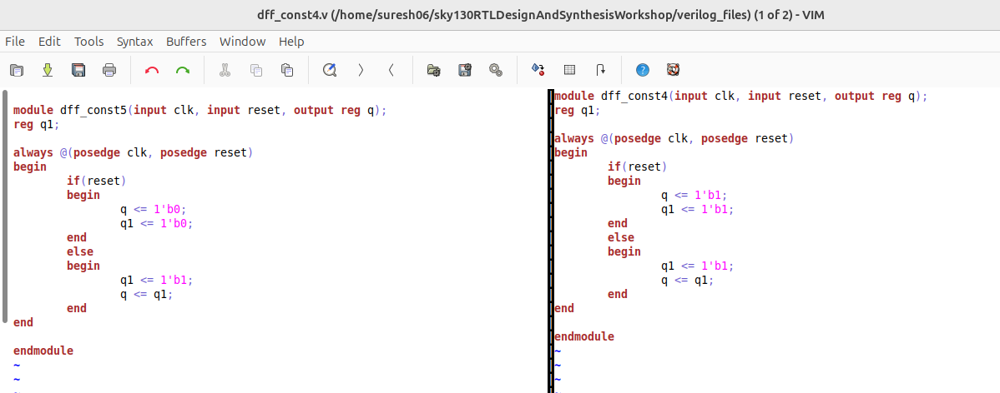
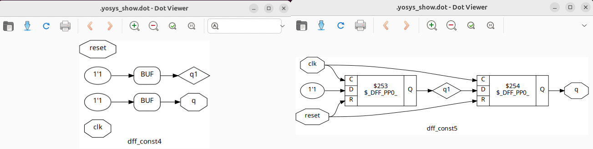
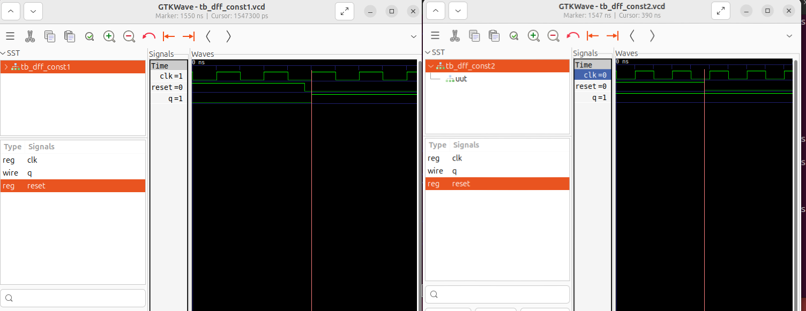
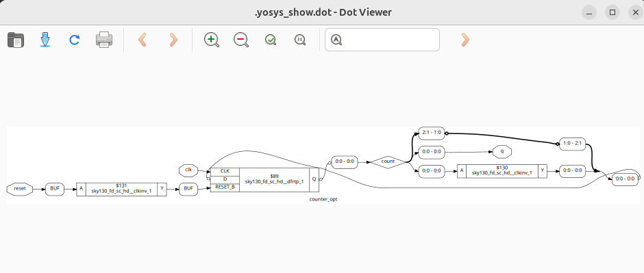
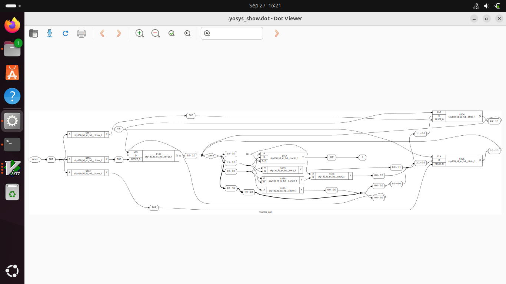

# Day 3 – Combinational and Sequential Optimizations  

This session dives into **logic optimizations** in digital design, with a focus on how synthesis tools like **Yosys** automatically simplify circuits. The goal is to understand how redundant logic is eliminated, how flip-flops are optimized, and why these transformations are essential for building an efficient chip.  

---

## Table of Contents  
- Introduction to Optimizations  
- Combinational Logic Optimizations  
- Sequential Logic Optimizations  
- Sequential Optimizations for Unused Outputs  
- Outcome  

---

## Introduction to Optimizations  

Optimizations are the backbone of **efficient RTL-to-GDS flow**. Once the design is written in RTL, the synthesis tool takes over and applies multiple techniques to make it **smaller, faster, and power-efficient**.  

Key points in optimization:  
- **Constant Propagation** → replacing signals tied to `1` or `0` with constants directly.  
- **Redundancy Removal** → removing gates that do not contribute to outputs.  
- **Logic Simplification** → applying Boolean algebra rules to reduce expressions.  
- **Dead Code Elimination** → wires or modules with no fanout are dropped.  

Without these steps, designs would be unnecessarily large, slow, and inefficient.  

---

## Combinational Logic Optimizations  

Combinational optimizations are focused purely on logic gates. The synthesis tool evaluates every path and simplifies wherever possible.  

### Core Concepts:  
- **Constant Propagation**:  
  Example → `y = a & 1` reduces to `y = a`.  
  The tool replaces the `& 1` logic with a direct connection, saving a gate.  

- **Boolean Simplification**:  
  `(a & b) | (a & ~b)` reduces to `a`.  
  Instead of using multiple AND/OR gates, it becomes a single wire assignment.  

- **Dead Logic Removal**:  
  Any intermediate signals not used in final outputs are completely removed.  



```bash
$ yosys
$ read_liberty -lib ../lib/sky130_fd_sc_hd__tt_025C_1v80.lib
$ read_verilog opt_check.v
$ synth -top opt_check
$ opt_clean -purge
$ abc -liberty ../lib/sky130_fd_sc_hd__tt_025C_1v80.lib
$ show
````





These optimizations **reduce area and critical path delay**, making the design more compact and faster.

---

## Sequential Logic Optimizations

Sequential optimizations focus on **flip-flops and registers**. Since they define the timing of the design, optimizing them has a direct impact on **performance and power**.

### Core Concepts:

* **Retiming**:
  Moving flip-flops across combinational logic to balance path delays.
  Example → If logic between two flops is too long, synthesis can shift one flop forward or backward so that both paths meet timing.
  This technique is crucial for **meeting setup/hold requirements** without changing external behavior.

* **Register Removal**:
  Flops that don’t affect outputs or are tied to constants are removed.

* **Register Merging**:
  Two registers with identical behavior can be merged to reduce area.




```bash
$ yosys
$ read_liberty -lib ../lib/sky130_fd_sc_hd__tt_025C_1v80.lib
$ read_verilog dff_const1.v
$ synth -top dff_const1
$ dfflibmap -liberty  ../lib/sky130_fd_sc_hd__tt_025C_1v80.lib 
$ abc -liberty ../lib/sky130_fd_sc_hd__tt_025C_1v80.lib 
$ show
```


These steps are important for **timing closure** and avoiding unnecessary power dissipation.

---

## Sequential Optimizations for Unused Outputs

Registers that drive unused signals waste **area and dynamic power**. Removing them is one of the simplest but most effective optimizations.

### Core Concepts:

* **Dead Register Elimination**: If a flop’s output never propagates to a primary output or another used module, it is pruned.
* **Output Pruning**: Wires or ports declared but not connected are also dropped.
* **Glitch Avoidance with Flops**: Introducing flops in long combinational paths ensures stable signals and avoids hazards.


```bash
$ yosys
$ read_verilog counter_opt.v
$ synth -top counter_opt
$ dfflibmap -liberty ../lib/sky130_fd_sc_hd__tt_025C_1v80.lib 
$ abc -liberty ../lib/sky130_fd_sc_hd__tt_025C_1v80.lib 
$ show
```


This pruning reduces **leakage power** and improves **clock tree efficiency** since fewer registers are clocked.

---

## Outcome

By the end of **Day 3**, we have:

* Learned the **importance of optimizations** in digital design.
* Seen how **constant propagation, Boolean simplification, and redundancy removal** simplify combinational logic.
* Understood **sequential techniques like retiming, register removal, and merging**.
* Explored how **unused outputs and flops** are eliminated automatically by tools.
* Connected the role of flops in **glitch avoidance and timing balance**.

**Final Flow Recap:**
`RTL → Combinational Optimizations → Sequential Optimizations → Pruned Netlist → Better PPA`

---


