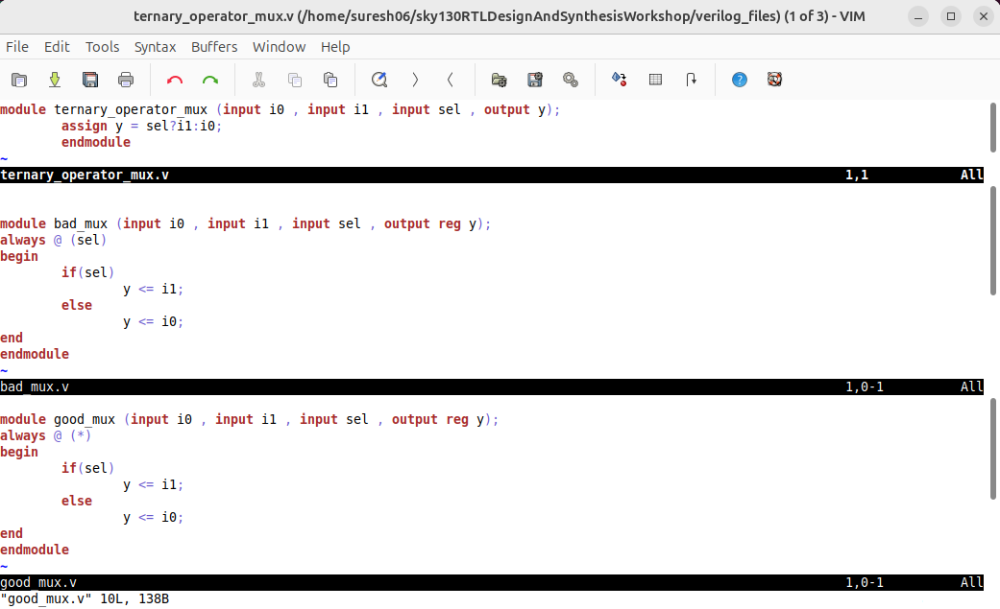
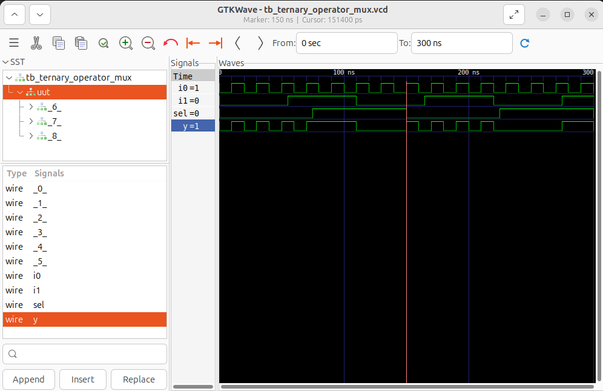
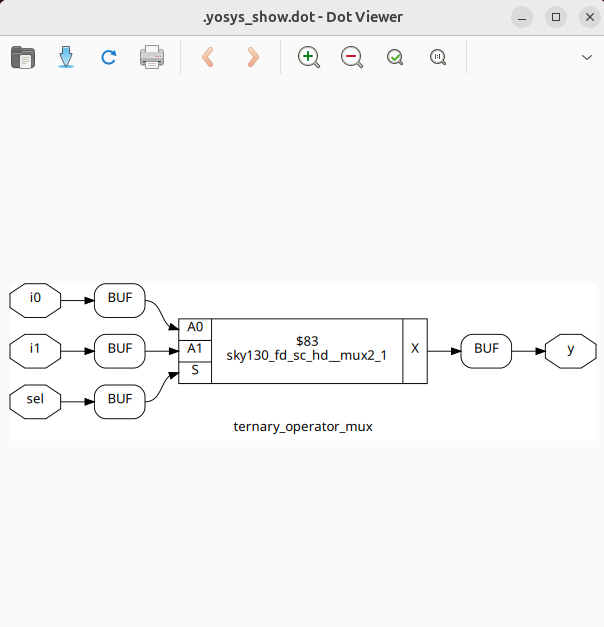
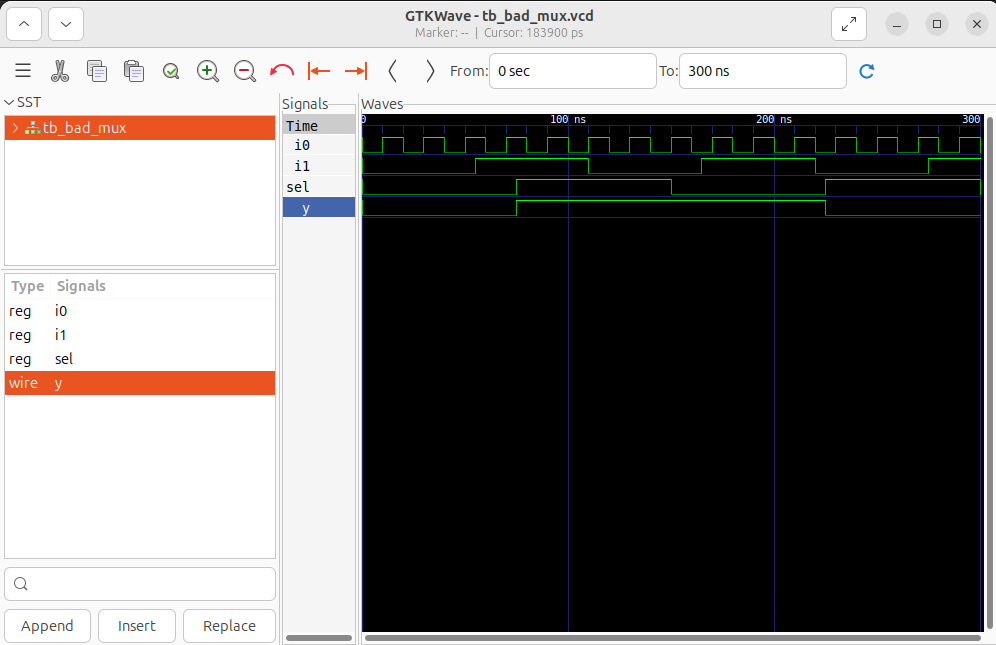
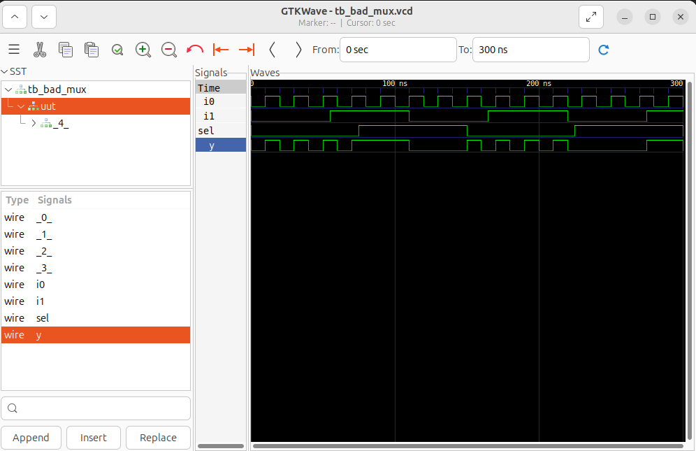
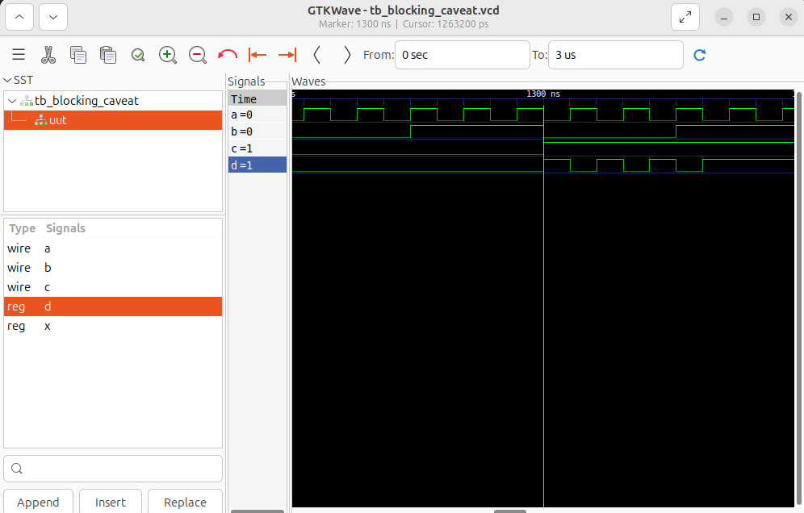
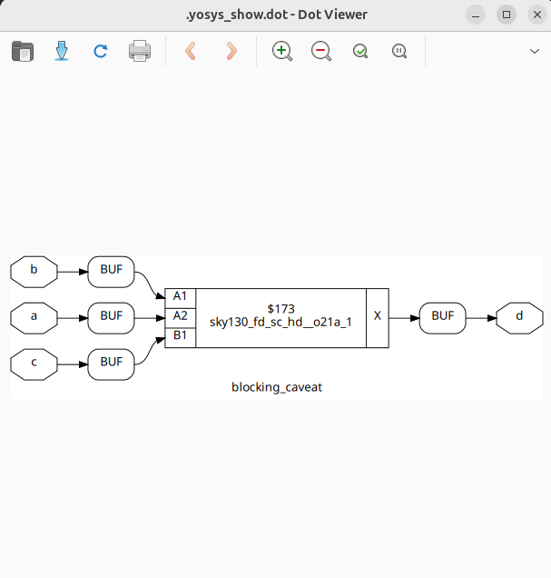
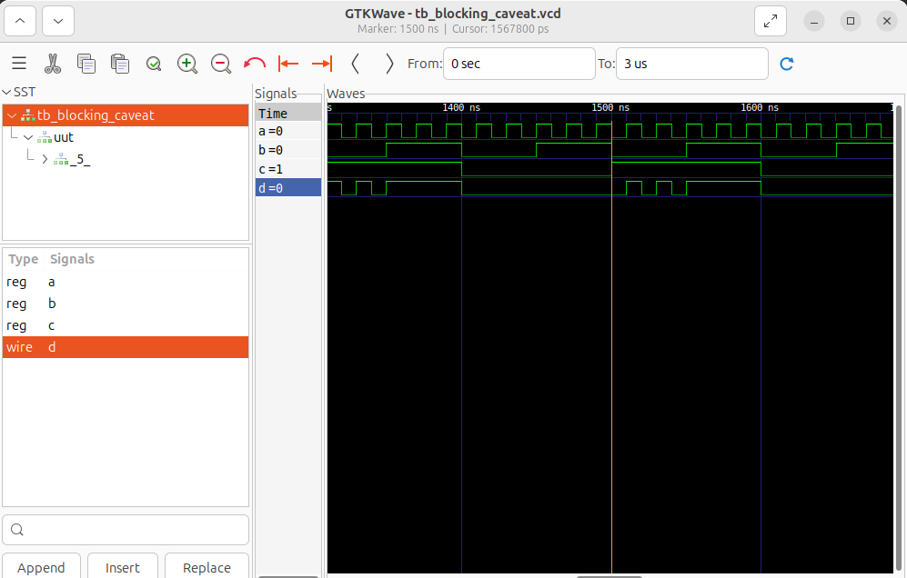

# Day 4 – Gate-Level Simulation (GLS), Blocking vs Non-Blocking in Verilog, and Synthesis-Simulation Mismatch  

This session focuses on verifying synthesized designs through **GLS**, studying **synthesis-simulation mismatches**, and learning correct **coding styles** with blocking vs non-blocking assignments.  

---

## Table of Contents  

- Gate-Level Simulation (GLS)  
- Synthesis-Simulation Mismatch  
- Blocking vs Non-Blocking Assignments in Verilog  
- Lab 1: Ternary Operator MUX  
- Lab 2: Bad MUX Example  
- Lab 3: Blocking Assignment Caveat  
- Summary  

---

## Gate-Level Simulation (GLS)  

**GLS** is the simulation of the **gate-level netlist** generated by synthesis.  
It ensures that the design we synthesized using the `.lib` file and standard cells behaves exactly like the RTL.  

Key points:  
- GLS validates that **RTL ↔ synthesized netlist** are functionally equivalent.  
- It includes real **cell delays, mapped logic, and possible glitches**.  
- GLS can be run with SDF (Standard Delay Format) for **setup/hold timing verification**.  
- Must be run before tapeout to catch mismatches and real-world timing issues.  

**Flow:**  
```

RTL Code → Synthesis with .lib → Netlist
Netlist + Library Models → GLS → Compare with RTL Simulation

````

---

## Synthesis-Simulation Mismatch  

Sometimes, simulation results at RTL level **do not match** the GLS results. This is called a **synthesis-simulation mismatch**.  

### Common causes:  
- **Incomplete sensitivity list** → RTL sim doesn’t trigger updates when inputs change.  
- **Blocking vs Non-blocking misuse** → Order of execution changes logic in RTL sim but not in hardware.  
- **Non-synthesizable constructs** → `initial`, delays (`#`), `force/release`.  
- **Uninitialized signals** → RTL may use `x/z`, synthesis may optimize away.  

### Best practices:  
- Always use `always @(*)` for combinational blocks.  
- Use blocking (`=`) for combinational logic, non-blocking (`<=`) for sequential logic.  
- Avoid delays, initial blocks, and simulation-only constructs in synthesizable code.  

---

## Blocking vs Non-Blocking Assignments  

- **Blocking (`=`)** → executes sequentially in code order. Best for combinational logic.  
- **Non-Blocking (`<=`)** → schedules updates in parallel. Best for sequential logic.  

### Example:  

Blocking:  
```verilog
always @(*) y = a & b;
````

Non-Blocking:

```verilog
always @(posedge clk) q <= d;
```

### Comparison

| Blocking (`=`)        | Non-Blocking (`<=`) |
| --------------------- | ------------------- |
| Executes immediately  | Updates scheduled   |
| Order-dependent       | Parallel updates    |
| Used in combinational | Used in sequential  |
| Can cause race issues | Avoids race issues  |

---

## Labs

---

### Lab 1: Ternary Operator MUX

A **2:1 MUX** using ternary operator – simple and synthesizable.

**Verilog Code:**

```verilog
module ternary_operator_mux (input i0, input i1, input sel, output y);
  assign y = sel ? i1 : i0;
endmodule
```


**Simulation :**

```
$ iverilog ternary_operator_mux.v tb_ternary_operator_mux.v
$ ./a.out
$ gtkwave tb_ternary_operator_mux.vcd
```

**Yosys Synthesis:**

```
$ read_liberty -lib ../lib/sky130_fd_sc_hd__tt_025C_1v80.lib
$ read_verilog ternary_operator_mux.v
$ synth -top ternary_operator_mux
$ abc -liberty ../lib/sky130_fd_sc_hd__tt_025C_1v80.lib
$ write_verilog -noattr ternary_operator_net.v
$ show
```


**GLS Simulation:**

```
$ iverilog ../my_lib/verilog_model/primitives.v \
  ../my_lib/verilog_model/sky130_fd_sc_hd.v \
  ternary_operator_net.v \
  tb_ternary_operator_mux.v
$ ./a.out
$ gtkwave tb_ternary_operator_mux.vcd
```


---

### Lab 2: Bad MUX Example

MUX coded with **incomplete sensitivity list** and **wrong assignment style**.

**Problematic Verilog:**

```verilog
module bad_mux (input i0, input i1, input sel, output reg y);
  always @ (sel) begin
    if (sel)
      y <= i1;
    else
      y <= i0;
  end
endmodule
```

**Pitfalls:**

* Sensitivity list has only `sel`.
* Used non-blocking (`<=`) in combinational block.
* Leads to **synthesis-simulation mismatch**.

**Corrected Verilog:**

```verilog
always @ (*) begin
  if (sel)
    y = i1;
  else
    y = i0;
end
```

**Simulation :**

```
$ iverilog bad_mux.v tb_bad_mux.v
$ ./a.out
$ gtkwave tb_bad_mux.vcd
```


**Yosys Synthesis:**

```
$ read_liberty -lib ../lib/sky130_fd_sc_hd__tt_025C_1v80.lib
$ read_verilog bad_mux.v
$ synth -top bad_mux
$ abc -liberty ../lib/sky130_fd_sc_hd__tt_025C_1v80.lib
$ write_verilog -noattr bad_mux_net.v
$ show
```

**GLS Simulation:**

```
$ iverilog ../my_lib/verilog_model/primitives.v \
    ../my_lib/verilog_model/sky130_fd_sc_hd.v \
    bad_mux_net.v \
    tb_bad_mux.v
$ ./a.out
$ gtkwave tb_bad_mux.vcd
```


---

### Lab 3: Blocking Assignment Caveat

Blocking updates occur in **order**, which can lead to wrong logic if a variable is used before being updated.

**Problematic Example:**

```verilog
module blocking_caveat (input a, input b, input c, output reg d);
  reg x;
  always @ (*) begin
    d = x & c; // uses old x
    x = a | b; // x updated after d calculation
  end
endmodule
```

**Corrected Example:**

```verilog
always @ (*) begin
  x = a | b;
  d = x & c; // now uses updated x
end
```

**Simulation :**

```
$ iverilog blocking_caveat.v tb_blocking_caveat.v
$ ./a.out
$ gtkwave tb_blocking_caveat.vcd
```


**Yosys Synthesis:**

```
$ read_liberty -lib ../lib/sky130_fd_sc_hd__tt_025C_1v80.lib
$ read_verilog blocking_caveat.v
$ synth -top blocking_caveat
$ abc -liberty ../lib/sky130_fd_sc_hd__tt_025C_1v80.lib
$ write_verilog -noattr blocking_caveat_net.v
$ show
```


**GLS Simulation:**

```
$ iverilog ../my_lib/verilog_model/primitives.v \
    ../my_lib/verilog_model/sky130_fd_sc_hd.v \
    blocking_caveat_net.v \
    tb_blocking_caveat.v
$ ./a.out
$ gtkwave tb_blocking_caveat.vcd
```


---

**Observation:**

* In RTL sim, order of assignments mattered.
* In synthesis, combinational logic is optimized, but coding mistakes can cause **mismatches and unexpected results**.

---

## Summary

* **GLS** validates correctness after synthesis with real library cells.
* **Synthesis-Simulation mismatches** arise from incomplete sensitivity lists, blocking misuse, and non-synthesizable code.
* **Blocking vs Non-Blocking** assignments must be used properly:

  * Blocking (`=`) → Combinational logic
  * Non-Blocking (`<=`) → Sequential logic
* Labs demonstrated how small RTL mistakes can break functionality after synthesis.

**Final Flow Recap:**

```
RTL → Synthesis → Netlist → GLS → Verify with Testbench
```
